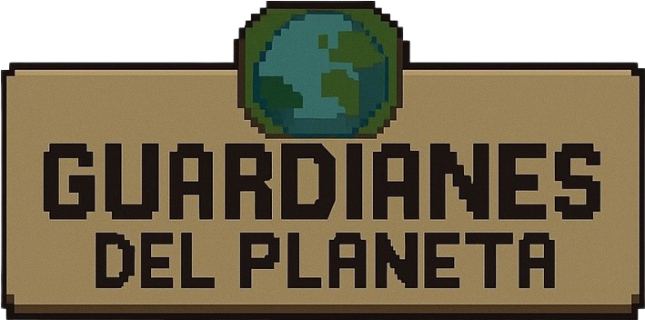

   

🌍✨ Guardianes del planeta! ✨🌍

  

   

🎯 Objetivo General del Videojuego

Desarrollar un videojuego educativo en Python con Pygame que fomente la concientización ambiental en los jugadores, motivándolos a participar en acciones sostenibles mientras aprenden jugando.
Todo esto alineado con el Objetivo de Desarrollo Sostenible 11.

   

🎯 Objetivos Específicos

✔️ Educar a los jugadores sobre el impacto de sus acciones en el medio ambiente.
✔️ Promover hábitos sostenibles y buenas prácticas ecológicas.
✔️ Concienciar sobre la importancia de mantener entornos limpios, saludables y seguros.

   

🎬 Trailer Oficial

 (Trailer disponible próximamente) 📽️ <strong>Muy pronto aquí podrás ver el trailer oficial</strong>  

   

⭐ Características Principales

  

🗺️ Tres niveles distintos y educativos

Cada nivel representa un entorno real y una misión ecológica diferente:

🟢 Parque – Recoge basura y limpia la zona
🟡 Calle – Siembra semillas y ayuda a que crezcan árboles
🔵 Ciudad – Repara edificios y rescata la comunidad

  

    

   

⏸️ Menú de Pausa Interactivo

Permite:
🔁 Reiniciar la partida
⏸️ Pausar
▶️ Reanudar

  
  

   

🧍‍♂️🧍‍♀️ Selección de Personaje

El jugador puede elegir entre:
👦 Personaje Masculino
👩 Personaje Femenino

Ambos cuentan con animaciones fluidas, sprites personalizados y un estilo visual atractivo.

  

   

   

🎮 Selección de Dificultad

Dos modos disponibles:

🟢 Principiante – Más tiempo, menos dificultad
🔴 Avanzado – Menos tiempo y más reto

   

🌐 Cambio de Idioma

Disponible en:
🇪🇸 Español
🇬🇧 Inglés

  
  

   

🕹️ Controles del Juego

🔄 Movimiento

⬆️⬇️⬅️➡️ o W A S D

 
🗑️ Acción principal

<kbd>E</kbd> – Recoger basura, plantar semillas, interactuar

 
🛠️ Reparar edificios

<kbd>R</kbd>

   

⚙️ Mecánicas del Juego
 
❌ Sistema de LOSE

El jugador pierde si el cronómetro llega a cero.

 
🏆 Sistema de WIN

🟢 Nivel 1: Recoger toda la basura
🌱 Nivel 2: Plantar todas las semillas
🏚️ Nivel 3: Reparar todos los edificios

  

    

   

⏱️ Cronómetro Dinámico

Cuando quedan 30 segundos, el tiempo se vuelve rojo para aumentar tensión y urgencia.
La duración varía según nivel y dificultad.

   

🧩 Estructura del Proyecto
Guardianes_del_planeta/
│── assets/
│   ├── personajes/
│   ├── niveles/
│   ├── sonidos/
│   ├── efectos/
│   └── ui/
│
│── src/
│   ├── main.py
│   ├── settings.py
│   ├── niveles.py
│   ├── personajes.py
│   ├── mecanicas.py
│   ├── idioma.py
│   └── utils.py
│
└── README.md

   

🛠️ Instalación y Ejecución
1️⃣ Clonar el repositorio
git clone https://github.com/TU_USUARIO/guardianes_del_planeta.git
cd guardianes_del_planeta

2️⃣ Instalar dependencias
pip install -r requirements.txt

3️⃣ Ejecutar el juego
python src/main.py

   

👥 Créditos

👨‍💻 Desarrollador principal: Tu nombre
🎨 Diseño gráfico: Tu nombre / Equipo
📚 Documentación: Tu nombre
🌿 Basado en el ODS 11 – Ciudades y comunidades sostenibles

   

💚 Gracias por jugar Guardianes del Planeta

  
  

Si te gustó el proyecto, ¡no olvides dejar una ⭐ en GitHub!
